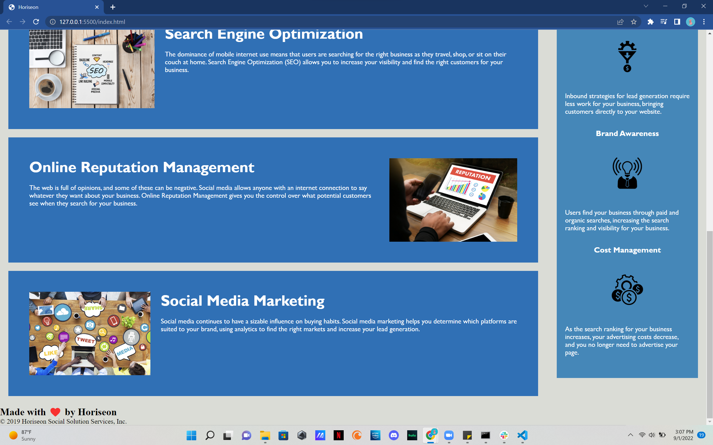

# Refactoring Horiseon Mockup Project

## Description

This mockup project was created to help students take a long list of code and improving it, making it more managable and simple to read. Changing 'div' tags into semantic tags to make it more organzied. Changing the CSS stylesheet to make it more managable and organized, reducing a lot of repeatative code. This project has helped me learn to stay organize with your code. 

## Installation

N/A

## Usage

To use this, open the Chrome DevTools to view the code. On the web application you can also use the navigation menu at the top right in the header, and click on the quick access links to view the articles down the page. 

    

    

## Credits

N/A

## License

MIT License

Copyright (c) 2022 PechMV

Permission is hereby granted, free of charge, to any person obtaining a copy
of this software and associated documentation files (the "Software"), to deal
in the Software without restriction, including without limitation the rights
to use, copy, modify, merge, publish, distribute, sublicense, and/or sell
copies of the Software, and to permit persons to whom the Software is
furnished to do so, subject to the following conditions:

The above copyright notice and this permission notice shall be included in all
copies or substantial portions of the Software.

THE SOFTWARE IS PROVIDED "AS IS", WITHOUT WARRANTY OF ANY KIND, EXPRESS OR
IMPLIED, INCLUDING BUT NOT LIMITED TO THE WARRANTIES OF MERCHANTABILITY,
FITNESS FOR A PARTICULAR PURPOSE AND NONINFRINGEMENT. IN NO EVENT SHALL THE
AUTHORS OR COPYRIGHT HOLDERS BE LIABLE FOR ANY CLAIM, DAMAGES OR OTHER
LIABILITY, WHETHER IN AN ACTION OF CONTRACT, TORT OR OTHERWISE, ARISING FROM,
OUT OF OR IN CONNECTION WITH THE SOFTWARE OR THE USE OR OTHER DEALINGS IN THE
SOFTWARE.
